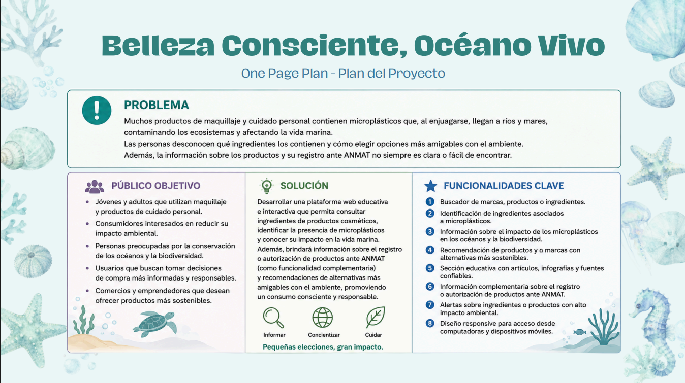
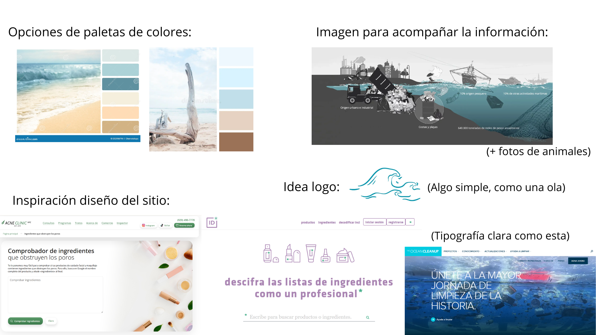

# Maquillaje & Microplásticos - Equipo 12B 
## Sitio Web con Impacto Social
En este repositorio, se presenta el sitio web "Maquillaje & Microplásticos" realizado durante el curso de programación frontend de CET.

## 📄 Descripción del proyecto
**¿Sabías que tu rutina de belleza diaria podría estar contaminando tu cuerpo y los océanos?**

La industria cosmética convencional utiliza ingredientes sintéticos, entre ellos los microplásticos. Estos ingredientes se encuentran en productos comunes como labiales, máscaras de pestañas y limpiadores faciales.

*  **Impacto Ecológico:** Cuando nos desmaquillamos o lavamos el rostro, estas partículas diminutas no son filtradas por las plantas de tratamiento de agua y terminan en los ríos y océanos. Allí, son ingeridas por la fauna marina, afectando la biodiversidad y entrando en la cadena alimentaria humana.

* **Salud Humana:** Estos plásticos invisibles se van acumulando en nuestro cuerpo con el tiempo. Esto puede provocar desde alergias en la piel hasta alteraciones en nuestras hormonas y otros problemas de salud a largo plazo.

El problema principal radica en la falta de transparencia en el etiquetado y en la desconexión que existe entre el cuidado personal y la responsabilidad ambiental.

---

## 🎯 Relación con los Objetivos de Desarrollo Sostenible (ODS)

Este proyecto se alinea directamente con los siguientes ODS de la Agenda 2030:

### ODS 14: Vida Submarina 
El objetivo central de la plataforma es reducir el flujo de microplásticos y contaminantes químicos que llegan al océano desde la industria cosmética. Al educar a los usuarios sobre qué productos evitar, contribuimos a disminuir la contaminación marina y a proteger la biodiversidad de los ecosistemas acuáticos.

### ODS 6: Agua Limpia y Saneamiento 
Los microplásticos en los cosméticos contaminan los suministros de agua dulce. Al reducir el consumo de estos productos, ayudamos a preservar la calidad del agua potable y facilitamos los procesos de saneamiento, asegurando que el agua utilizada para higiene no se convierta en un vehículo de contaminación.

### ODS 12: Producción y Consumo Responsables 
La plataforma fomenta el consumo responsable al capacitar a las usuarias para elegir productos seguros y sostenibles, presionando a la industria hacia métodos de producción más limpios.

---
## 💡 Solución Tecnológica:

Para estructurar nuestra idea inicial, desarrollamos el siguiente documento que resume nuestro público objetivo, el problema central y las funcionalidades clave de la web:

Si bien este fue nuestro punto de inicio, hay ideas que naturalmente fueron cambiando al avanzar con el proyecto.

### Funcionalidades Clave ###

* **Verificador Interactivo de Productos:** Desarrollamos un verificador con JavaScript donde el usuario ingresa los ingredientes de su producto (que se pueden encontrar en la etiqueta del mismo o buscándolos en internet) y el sistema detecta si contiene microplásticos, en tal caso recomendando el uso de otras opciones más "eco-friendly". A pesar de que intentamos incluir la mayor cantidad posible de microplásticos comunmente encontrados en cosméticos, incluso si el sistema no encuentra estos componentes en el producto, brindamos una lista creada por la organización Beat The Microbead para que los usuarios puedan revisar de manera más minuciosa si el resultado del verificador no los convence. 
* **Catálogo de Marcas Seguras:** Un panel interactivo que destaca marcas accesibles en Argentina detallando su compromiso ambiental y los productos que pueden encontrar en esta.
* **Secciones Educativas Visuales:** Uso de carrusel y acordeón para presentar información y explicar el impacto de los desechos en la salud, los alimentos y el turismo costero. Asimismo, la página cuenta con una sección dedicada a los sellos ecológicos que se puden encontrar en algunos productos y facilitan la identificación de marcas limpias.

La plataforma prioriza una interfaz limpia, visual y fácil de usar, permitiendo que la toma de decisiones conscientes sea accesible para todas.

---
## 🎨 Diseño (Moodboard)
### Explicación del Concepto Visual:
Nuestra identidad visual prioriza una estética limpia y minimalista. Nos inspiramos en los colores de los ecosistemas marinos que buscamos proteger, creando un contraste directo con los tonos de la contaminación.
Así como con el one page plan, varios conceptos planeados originalmente en el moodboard fueron evolucionando con el pasar de las clases.

Para nuestra interfaz, definimos las siguientes bases:
| Elemento | Descripción e Inspiración |
| :--- | :--- |
| **🎨 Paleta de Colores** | Tonos turquesas (agua limpia), tonos corales (arena) y marrones (contaminación). Buscamos un contraste natural y minimalista. |
| **🌊 Logo** | Una ola de trazos simples y fluidos. Representa la conexión directa entre nuestros hábitos y el océano. |
| **📝 Tipografía** | Fuentes claras, modernas y legibles para facilitar la lectura de información técnica. |

--- 
## 🧩 Archivos generados con asistencia de IA:
* `index.html` (Estructura semántica y layout principal)
* `styles.css` (Diseño responsivo, variables de color y animaciones fluidas)
* `script.js` (Lógica de validación del buscador de productos)
